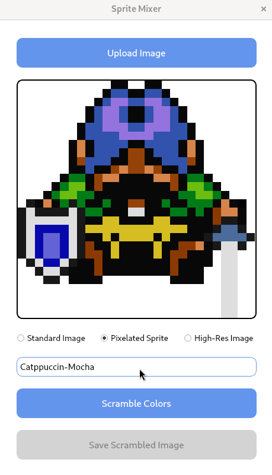
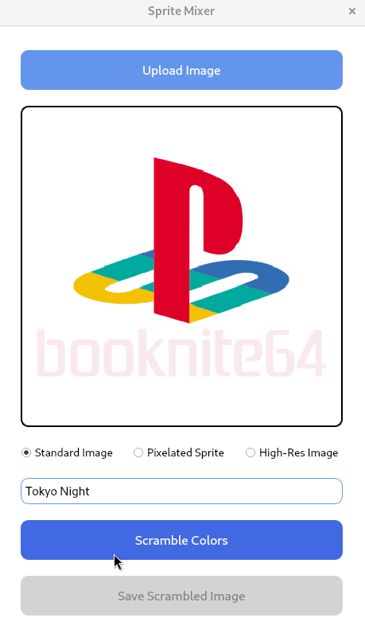

# Sprite Mixer

This application is a simple color mixer for sprite images and some higher resolution images. I made this to change the color scheme of logos and sprites to match my Linux terminal theme. I figured others could use or modify this while ricing their own linux distro.

## Features

<table>
  <tr>
    <td align="center">
      
      <br />
      <em>GIF 1</em>
    </td>
    <td align="center">
      
      <br />
      <em>GIF 2</em>
    </td>
  </tr>
</table>

* Mixes colors of sprite images and some higher resolution images
* Simple and intuitive graphical user interface
* Supports multiple color palettes (loaded from a JSON file)
* Three image processing modes: Regular Image, Pixelated Sprite, and High-Resolution Image
* Real-time preview of color changes
* Ability to save modified images with automatic file naming to prevent overwrites

## Setup

### Prerequisites

1. Python 3.7+
2. Required packages (install via `pip install -r requirements.txt`):
   * PyQt5
   * Pillow
   * numpy

### Usage

1. Run the application: `python3 sprite_mixer.py`
2. Click "Upload Image" to select an image file
3. Choose an image type (Regular, Pixelated Sprite, or High-Resolution) 
4. Select a color palette from the dropdown menu
5. Click "Scramble Colors" to apply the color mixing
6. Use "Save Scrambled Image" to save the modified image

## File Management

* Default save location: Same directory as the original image
* Automatic file naming: "{original_name}-sprite-mix.{extension}"
* Incremental naming to prevent overwrites: "{original_name}-sprite-mix-1.{extension}", etc.

## Color Palettes

Color palettes are loaded from a `color-palettes.json` file in the same directory as the script. 

You can add color palettes to this file using the following format:

```json
{
  "Palette Name": ["#HexColor1", "#HexColor2", "#HexColor3", ...],
  "Another Palette": ["#HexColor1", "#HexColor2", "#HexColor3", ...]
}
```

For example, to add the Catppuccin-Mocha palette, you would include:

```json
{
  "Catppuccin-Mocha": ["#1E1E2E", "#CDD6F4", "#F38BA8", "#A6E3A1", "#F9E2AF", "#89B4FA", "#F5C2E7", "#BAC2DE"]
}
```

You can add as many palettes as you like or just make your own.

## Author

[Your Name or Username]

## License

This project is licensed under the MIT License.

## Note

While this tool works best with sprite images and icons, it can also process higher resolution images. However, the results may vary for more complex, high-resolution images.

This tool is particularly useful for Linux enthusiasts who enjoy customizing their desktop environments ("ricing"). It allows for quick and easy color adjustments to make images match your chosen theme or color scheme.
